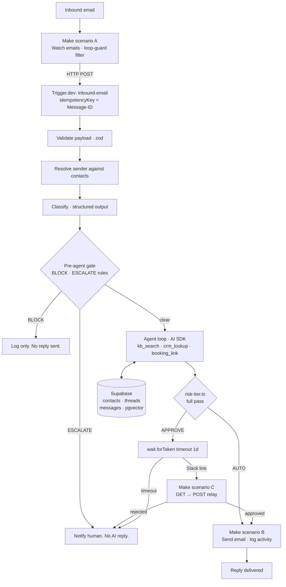

# Mailroom

An AI email agent for a shared sales inbox. It reads inbound mail, answers what
it can from a knowledge base, routes anything sensitive to a human for approval,
and deliberately stays silent on spam.

**[Watch the 4 minute walkthrough](TODO-loom-link)**

> Built as a working reference for how I'd structure an AI digital employee:
> Make for connectors, Trigger.dev for typed durable logic.

---

## The architecture bet

Make is excellent at connectors and poor at branching logic. Trigger.dev is the
inverse. So the mailbox, OAuth, and sending stay in Make, and every decision
lives in typed TypeScript that can be tested and version controlled.



The Make side is 10 modules across three scenarios. Everything that would have
become an unreadable router tree is a function instead.

Two things in that diagram are worth pausing on.

**The gate runs twice, and the first pass is the cheap one.** Every BLOCK and
ESCALATE rule is decidable from the classification alone, and both tiers mean
no AI-drafted reply is ever sent — so there is nothing for the agent to write.
Spam and escalations never reach a model call or a tool. The full pass still
re-checks both bands, so it remains correct on its own; skipping ahead is an
optimisation, not a precondition, and a test asserts the two never disagree.

**Scenario C exists for a boring reason.** A Slack incoming webhook can only
render a hyperlink, and a hyperlink is a `GET` — but completing a Trigger.dev
waitpoint is a `POST`. Two modules bridge the two. The token's callback URL
carries its own secret, so the relay stores no credentials.

## What's real and what's mocked

Stated up front so you don't have to go find out.

| Component                    | Status    | Notes                                                                          |
| ---------------------------- | --------- | ------------------------------------------------------------------------------ |
| Inbound to reply, end to end | **Real**  | Works from a clean clone via `pnpm sample`                                      |
| Classification               | **Real**  | Claude structured output, zod-validated                                        |
| Knowledge base retrieval     | **Real**  | pgvector cosine search, embeddings computed locally                            |
| Approval gate                | **Real**  | Trigger.dev waitpoint, live approve/reject links                               |
| Idempotency + loop guards    | **Real**  | Message-ID keyed, enforced twice; header-based guards                          |
| CRM                          | Mocked    | Supabase `contacts` table. Swapping to HubSpot is one file: `src/tools/crm.ts` |
| Meeting scheduling           | Mocked    | Returns a static booking link. No calendar writes.                             |
| Lead enrichment              | Not built | Out of scope                                                                   |
| Make blueprints              | Not built | `make/README.md` specifies all ten modules; exports are account-specific       |

Seed data is synthetic throughout, on the RFC 2606 reserved `.test` and
`.invalid` TLDs — a misconfigured demo cannot email a real person.

**Providers.** Claude does classification and the reply loop, and is the only
paid API here. Embeddings run locally through transformers.js (all-MiniLM-L6-v2,
384 dims) — no key, no cost, no network at query time. The model is named in
exactly one file, `src/agent/model.ts`.

That file currently pins `claude-haiku-4-5`, the cheapest model in the lineup,
so that iterating on the demo costs approximately nothing. Haiku 4.5 rejects the
`effort` parameter outright, so both provider-options objects are empty; moving
up to Sonnet 5 or Opus 5 means restoring `effort` in the same edit. The comment
in that file says so, because the two changes have to travel together.

## Design decisions

**Spam gets no reply.** The brief said "always respond." I don't think that's
right. An auto-reply confirms a live, human-monitored address and gets you added
to more lists. Spam is classified, logged, and dropped. Deciding when _not_ to
act is most of the work in an autonomous email agent.

**Approval is a waitpoint, not a status column.** `wait.forToken({ timeout:
"1d" })` pauses the run with no idle cost and resumes it when the approve link
is hit. The alternative is a `pending` row plus a polling cron, which is more
code, has no timeout semantics, and loses the run context.

**Idempotency is keyed on the RFC 5322 Message-ID**, enforced twice: as the
Trigger.dev `idempotencyKey` and as a unique constraint on `messages.message_id`.
Mail triggers re-fire. Double-replying to a customer is unrecoverable.

**Risk tiering is one pure function**, `src/lib/risk-tier.ts`, and it's the only
module with real test coverage. That's deliberate. It's the only place in the
system where a bug sends the wrong thing to a real person, so it's the only
place worth testing hard.

**The agent never fills gaps.** If a tool returns nothing, the reply says so and
offers a human. In any regulated or money-adjacent domain, a confidently
fabricated account status is worse than no reply at all. This is enforced in the
tool contracts, not just the prompt: every tool returns an explicit
`found: false` / `grounded: false` shape rather than throwing or returning null,
so "we don't have that" is a value the model receives and can report — and the
same boolean feeds the risk rule that gates ungrounded answers.

**Embeddings run locally.** all-MiniLM-L6-v2 through transformers.js, in
process, 384 dims. A knowledge base of a few dozen chunks does not need a
hosted embedding API, and this removes a key, a bill, and a network hop from
the hot path. The chosen model and the `vector(384)` column width are one
decision, not two — changing either means changing both and re-seeding.

## Running it locally

```bash
pnpm install
cp .env.example .env          # fill in the values listed there
```

Create the schema by running two files in the Supabase SQL Editor, in order:
`supabase/migrations/0001_init.sql`, then `supabase/seed.sql`. Two copy-pastes,
no CLI login and no project linking — worth it to keep setup under a minute.

```bash
pnpm seed:kb                  # embeds the knowledge base locally, free
pnpm dev                      # trigger.dev dev — tasks run on your machine
```

Then drive the task directly, with Make out of the loop:

```bash
pnpm sample --fixture general-question   # → RAG hit, auto-sends
pnpm sample --fixture account-question   # → draft, waitpoint, Slack approval
pnpm sample --fixture spam               # → blocked before any model call
pnpm sample --fixture spam --fresh       # new Message-ID, replays past idempotency
```

Offline checks need no credentials at all:

```bash
pnpm typecheck && pnpm lint && pnpm test
```

To run it through Make, build the three scenarios from `make/README.md`.

### What a green checkmark does and doesn't tell you

CI runs `tsc --noEmit`, `eslint`, and the risk-tier suite. That is a real
signal about the decision logic and the type-level contracts, and it says
nothing about whether Supabase, Anthropic, Slack, or Make are wired up
correctly — none of those are touched without credentials. The three `pnpm
sample` runs above are what actually proves the path end to end.

## Layout

```
src/
  trigger/inbound-email.ts   the spine — branching only
  agent/model.ts             the only place a model is named
  agent/classify.ts          generateObject, zod-validated
  agent/reply.ts             the tool loop
  tools/                     kb-search, crm, booking — zod in and out
  lib/risk-tier.ts           the safety-critical decision
  lib/risk-tier.test.ts      the only real test suite
  lib/embeddings.ts          local MiniLM, 384 dims
  lib/db.ts, notify.ts       everything with I/O, kept out of the spine
  schemas.ts                 zod contracts for every boundary
  env.ts                     parsed at import; missing vars fail at boot
make/README.md               the ten Make modules, spec'd
supabase/migrations/         schema + match_kb_chunks
supabase/seed.sql            synthetic contacts and KB text
scripts/                     seed-kb, send-sample, fixtures
```

## What I'd do next

- Replace the mock CRM with HubSpot (one file, the tool interface is already the
  seam)
- Real scheduling: freebusy query, propose slots, book only after the recipient
  picks one
- Sender verification (SPF/DKIM pass + exact contact match) as a hard gate
  before any reply containing account data, rather than routing it to approval
- Per-thread reply rate limiting, and hard escalation after 3 agent turns with
  no resolution
- Evaluation harness over a fixture set, scoring classification accuracy and
  risk-tier precision. Recall on the APPROVE tier matters far more than
  precision: a false AUTO is a customer-facing incident, a false APPROVE is
  someone clicking a button.
