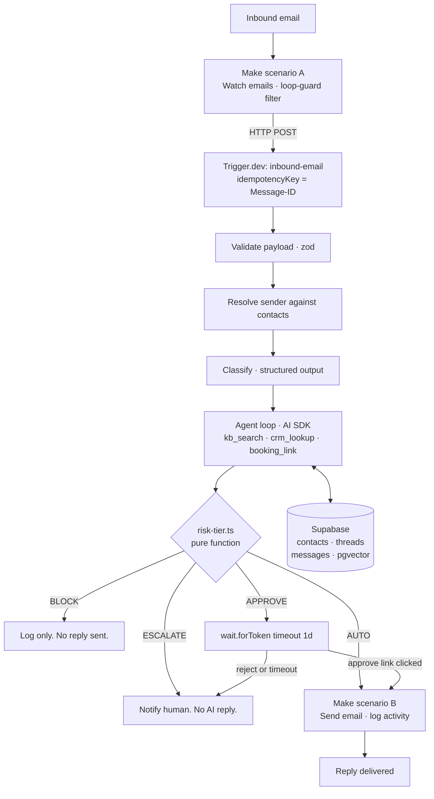

# Mailroom

An AI email agent for a shared sales inbox. It reads inbound mail, answers what
it can from a knowledge base, routes anything sensitive to a human for approval,
and deliberately stays silent on spam.

**[Watch the 4 minute walkthrough](TODO-loom-link)**

> Built as a working reference for how I'd structure an AI digital employee:
> Make for connectors, Trigger.dev for typed durable logic.

---

## The architecture bet

Make is excellent at connectors and poor at branching logic. Trigger.dev is the
inverse. So the mailbox, OAuth, and sending stay in Make, and every decision
lives in typed TypeScript that can be tested and version controlled.



The Make side is 8 modules total across both scenarios. Everything that would
have become an unreadable router tree is a function instead.

## What's real and what's mocked

Stated up front so you don't have to go find out.

| Component                    | Status    | Notes                                                                          |
| ---------------------------- | --------- | ------------------------------------------------------------------------------ |
| Inbound to reply, end to end | **Real**  | Works from a clean clone                                                       |
| Classification               | **Real**  | LLM structured output, zod-validated                                           |
| Knowledge base retrieval     | **Real**  | pgvector similarity search in Supabase                                         |
| Approval gate                | **Real**  | Trigger.dev waitpoint, live approve/reject links                               |
| Idempotency + loop guards    | **Real**  | Message-ID keyed, header-based guards                                          |
| CRM                          | Mocked    | Supabase `contacts` table. Swapping to HubSpot is one file: `src/tools/crm.ts` |
| Meeting scheduling           | Mocked    | Returns a static booking link. No calendar writes.                             |
| Lead enrichment              | Not built | Emits `enrichment_queued` and stops                                            |

Seed data is synthetic. Make blueprint exports in `make/blueprints/` have been
scrubbed of connection IDs and webhook URLs.

## Design decisions

**Spam gets no reply.** The brief said "always respond." I don't think that's
right. An auto-reply confirms a live, human-monitored address and gets you added
to more lists. Spam is classified, logged, and dropped. Deciding when _not_ to
act is most of the work in an autonomous email agent.

**Approval is a waitpoint, not a status column.** `wait.forToken({ timeout:
"1d" })` pauses the run with no idle cost and resumes it when the approve link
is hit. The alternative is a `pending` row plus a polling cron, which is more
code, has no timeout semantics, and loses the run context.

**Idempotency is keyed on the RFC 5322 Message-ID**, enforced twice: as the
Trigger.dev `idempotencyKey` and as a unique constraint on `messages.message_id`.
Mail triggers re-fire. Double-replying to a customer is unrecoverable.

**Risk tiering is one pure function**, `src/lib/risk-tier.ts`, and it's the only
module with real test coverage. That's deliberate. It's the only place in the
system where a bug sends the wrong thing to a real person, so it's the only
place worth testing hard.

**The agent never fills gaps.** If a tool returns nothing, the reply says so and
offers a human. In any regulated or money-adjacent domain, a confidently
fabricated account status is worse than no reply at all.

## Running it locally

```bash
pnpm install
cp .env.example .env          # fill in the values listed there
pnpm supabase db push         # schema + seed
pnpm dlx trigger.dev@latest dev
```

Then either import the sanitized blueprints from `make/blueprints/` into a Make
account, or POST a sample payload directly at the task to skip Make entirely:

```bash
pnpm tsx scripts/send-sample.ts --fixture spam
pnpm tsx scripts/send-sample.ts --fixture account-question
pnpm tsx scripts/send-sample.ts --fixture general-question
```

## Layout

```
src/
  trigger/inbound-email.ts   the spine
  tools/                     kb-search, crm, booking
  lib/risk-tier.ts           the safety-critical decision
  lib/risk-tier.test.ts      the only real test suite
  schemas.ts                 zod contracts for every boundary
make/blueprints/             sanitized scenario exports
supabase/migrations/         schema + synthetic seed
```

## What I'd do next

- Replace the mock CRM with HubSpot (one file, the tool interface is already the
  seam)
- Real scheduling: freebusy query, propose slots, book only after the recipient
  picks one
- Sender verification (SPF/DKIM pass + exact contact match) as a hard gate
  before any reply containing account data, rather than routing it to approval
- Per-thread reply rate limiting, and hard escalation after 3 agent turns with
  no resolution
- Evaluation harness over a fixture set, scoring classification accuracy and
  risk-tier precision. Recall on the APPROVE tier matters far more than
  precision: a false AUTO is a customer-facing incident, a false APPROVE is
  someone clicking a button.
