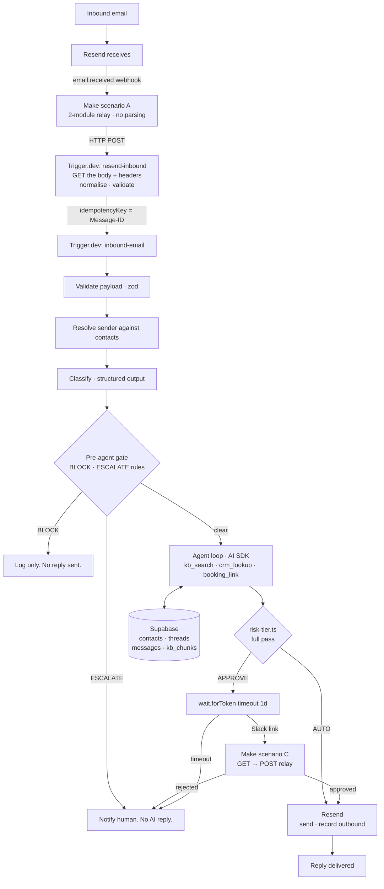

# Mailroom

An AI email agent for a shared sales inbox. It reads inbound mail, answers what
it can from a knowledge base, routes anything sensitive to a human for approval,
and deliberately stays silent on spam.

**[Watch the 4 minute walkthrough](TODO-loom-link)**

> Built as a working reference for how I'd structure an AI digital employee:
> Make for connectors, Trigger.dev for typed durable logic.

---

## The architecture bet

Make is excellent at connectors and poor at branching logic. Trigger.dev is the
inverse. So Make holds the HTTP plumbing nothing else can do, and every decision
lives in typed TypeScript that can be tested and version controlled.

The split is drawn per-capability, not per-direction. Both Make scenarios exist
for the same narrow reason — an HTTP shape mismatch. Trigger.dev v4 has no
incoming-webhook trigger, so two modules turn Resend's `email.received` POST
into a task trigger. A Slack hyperlink is a `GET` and completing a waitpoint is
a `POST`, so three modules bridge that. Neither scenario parses anything.

Everything else is TypeScript, including both halves of the mail. Sending is one
authenticated POST to Resend. Receiving is a webhook that carries **metadata
only** — no body, no headers — so the body, the thread key and the SPF/DKIM
verdicts come from a second authenticated `GET`, and normalising that response
is real logic that belongs somewhere it can be read. "Use the connector platform
for the things that are actually hard" turns out to be a shorter list than it
first looked.



The Make side is 5 modules across two scenarios, none of which makes a decision.
Everything that would have become an unreadable router tree is a function
instead.

Three things in that diagram are worth pausing on.

**Ingestion is two tasks, and the seam matters.** `resend-inbound` is the only
part that knows Resend exists: it fetches the message, strips HTML, derives the
thread key, and forwards the raw `Authentication-Results` header.
`inbound-email` is a pure function of a validated payload and has no idea where
that payload came from. That is what lets `pnpm sample` drive the entire system
from a JSON fixture with no mail provider in the loop — and it is why swapping
Resend for a real mailbox later is one new file, not a rewrite.

**The gate runs twice, and the first pass is the cheap one.** Every BLOCK and
ESCALATE rule is decidable from the classification alone, and both tiers mean
no AI-drafted reply is ever sent — so there is nothing for the agent to write.
Spam and escalations never reach a model call or a tool. The full pass still
re-checks both bands, so it remains correct on its own; skipping ahead is an
optimisation, not a precondition, and a test asserts the two never disagree.

**Scenario C exists for a boring reason.** A Slack incoming webhook can only
render a hyperlink, and a hyperlink is a `GET` — but completing a Trigger.dev
waitpoint is a `POST`. Three modules bridge the two. The token's callback URL
carries its own secret, so the relay stores no credentials.

## What's real and what's mocked

Stated up front so you don't have to go find out.

| Component                    | Status    | Notes                                                                          |
| ---------------------------- | --------- | ------------------------------------------------------------------------------ |
| Inbound to reply, end to end | **Real**  | Works from a clean clone via `pnpm sample`                                      |
| Classification               | **Real**  | Claude structured output, zod-validated                                        |
| Knowledge base retrieval     | **Real**  | Postgres full-text search, ranked, with a grounding floor. Lexical, not semantic — see below |
| Sending                      | **Real**  | Resend, threaded via In-Reply-To, idempotent on the inbound Message-ID          |
| Approval gate                | **Real**  | Trigger.dev waitpoint, live approve/reject links                               |
| Idempotency + loop guards    | **Real**  | Message-ID keyed, enforced three times; header-based guards                    |
| CRM                          | Mocked    | Supabase `contacts` table. Swapping to HubSpot is one file: `src/tools/crm.ts` |
| Meeting scheduling           | Mocked    | Returns a static booking link. No calendar writes.                             |
| Lead enrichment              | Not built | Out of scope                                                                   |
| Inbound ingestion            | **Real**  | Resend `email.received` → retrieve → normalise. Metadata-only webhook, so the body comes from a second call |
| Make blueprints              | Partial   | Scenario C is committed and importable; A is specified in `make/README.md` but not exported |
| Webhook signature check      | Not built | Resend signs with Svix; the Make relay drops it. See `make/README.md` |

Seed data is synthetic throughout, on the RFC 2606 reserved `.test` and
`.invalid` TLDs — a misconfigured demo cannot email a real person.

**Providers.** Claude does classification and the reply loop, and is the only
metered API here. Resend sends, on a free tier that comfortably covers a demo.
Retrieval is Postgres, so it costs nothing and adds no provider. The model is
named in exactly one file, `src/agent/model.ts`.

That file currently pins `claude-haiku-4-5`, the cheapest model in the lineup,
so that iterating on the demo costs approximately nothing. Haiku 4.5 rejects the
`effort` parameter outright, so both provider-options objects are empty; moving
up to Sonnet 5 or Opus 5 means restoring `effort` in the same edit. The comment
in that file says so, because the two changes have to travel together.

## Design decisions

**Spam gets no reply.** The brief said "always respond." I don't think that's
right. An auto-reply confirms a live, human-monitored address and gets you added
to more lists. Spam is classified, logged, and dropped. Deciding when _not_ to
act is most of the work in an autonomous email agent.

**Approval is a waitpoint, not a status column.** `wait.forToken({ timeout:
"1d" })` pauses the run with no idle cost and resumes it when the approve link
is hit. The alternative is a `pending` row plus a polling cron, which is more
code, has no timeout semantics, and loses the run context.

**Idempotency is keyed on the RFC 5322 Message-ID**, enforced three times: as
the Trigger.dev `idempotencyKey`, as a unique constraint on
`messages.message_id`, and as the `Idempotency-Key` on the Resend send. Mail
triggers re-fire. Double-replying to a customer is unrecoverable.

The third layer is not belt-and-braces, it covers a window the other two miss.
A send that succeeds at Resend but fails before the outbound row is written
gets retried by Trigger.dev, and the outbound row is keyed on a fresh UUID, so
nothing downstream would notice the duplicate. The inbound Message-ID is stable
across every attempt of the run, so Resend returns the original send instead of
delivering a second copy.

**Risk tiering is one pure function**, `src/lib/risk-tier.ts`, and it's the only
module with real test coverage. That's deliberate. It's the only place in the
system where a bug sends the wrong thing to a real person, so it's the only
place worth testing hard.

**The agent never fills gaps.** If a tool returns nothing, the reply says so and
offers a human. In any regulated or money-adjacent domain, a confidently
fabricated account status is worse than no reply at all. This is enforced in the
tool contracts, not just the prompt: every tool returns an explicit
`found: false` / `grounded: false` shape rather than throwing or returning null,
so "we don't have that" is a value the model receives and can report — and the
same boolean feeds the risk rule that gates ungrounded answers.

**Retrieval is full-text search, and that is a downgrade I chose.** This
started as pgvector with all-MiniLM-L6-v2 embedded locally, which was lovely
until it had to run in a deployed container: ~90MB of model weights pulled at
every cold start, `onnxruntime-node` externalised out of the bundle because
esbuild has no loader for prebuilt `.node` binaries, against a 120-second run
ceiling. For eight knowledge base chunks, that is a lot of machinery bought
with the first impression of a live demo.

So `search_kb_chunks` is `ts_rank` over a generated `tsvector` column. The
query is normalised into lexemes and OR-ed rather than passed through
`plainto_tsquery`, which ANDs — ANDing means a question the knowledge base does
answer returns nothing the moment the agent phrases it with one word we never
wrote down.

What survives is the part that mattered: the grounding floor. A rank below it
returns zero rows, `hasGroundingEvidence` goes false, and the reply is gated
rather than invented — exactly as the cosine floor did. `src/tools/kb-search.ts`
is the entire seam, so restoring pgvector is one function and no caller
changes.

**Sender authentication is parsed in TypeScript, and nowhere else.** SPF and
DKIM are not exposed as booleans by anything upstream; they live inside the
`Authentication-Results` header. The adapter forwards the raw string and
`src/lib/auth-results.ts` decides, because a regex that gates account-data
disclosure belongs somewhere it can be read and tested. A missing header reads
as *not authenticated* — for a signal whose only job is to gate account data,
unknown has to mean no.

That last sentence is doing real work here, because whether Resend returns the
header at all is not yet verified against a live response. If it doesn't, the
mapping onto the payload's optional `spfPass`/`dkimPass` booleans is a change to
one function. Until then the failure is a false escalation, never a false send.

**The model never sees markup.** Resend hands back `text: null` for a message
whose sender only produced an HTML part, and `src/lib/inbound-normalize.ts`
strips it. That is not tidiness: an unstripped body buries the actual question
inside a template's table scaffolding, and puts whatever the sender wrote in an
HTML comment in front of a model that is about to draft a customer reply.

## Running it locally

```bash
pnpm install
cp .env.example .env          # fill in the values listed there
```

Create the schema by running two files in the Supabase SQL Editor, in order:
`supabase/migrations/0001_init.sql`, then `supabase/seed.sql`. Two copy-pastes,
no CLI login and no project linking — worth it to keep setup under a minute.

There is no indexing step. `kb_chunks.content_tsv` is a generated column, so
the knowledge base is searchable the moment `seed.sql` finishes.

```bash
pnpm dev                      # trigger.dev dev — tasks run on your machine
```

Then drive the task directly, with Make out of the loop:

```bash
pnpm sample --fixture general-question   # → RAG hit, auto-sends
pnpm sample --fixture account-question   # → draft, waitpoint, Slack approval
pnpm sample --fixture spam               # → blocked before any model call
pnpm sample --fixture spam --fresh       # new Message-ID, replays past idempotency
```

Offline checks need no credentials at all:

```bash
pnpm typecheck && pnpm lint && pnpm test
```

### Running it from real mail

Add a receiving address in Resend, build the two scenarios in `make/README.md`,
and point the Resend webhook at scenario A. Subscribe it to **`email.received`
only** — leave outbound events on and every reply the agent sends triggers a
fresh ingestion of its own reply.

Then decide which Trigger.dev environment the relay points at. The secret key in
scenario A's `Authorization` header is what chooses.

A `tr_dev_…` key routes runs to your **dev** environment, which only executes
while `pnpm dev` is running on your machine. That is fine for wiring things up
and wrong for anything you intend to leave running: the approval branch parks
on `wait.forToken({ timeout: "1d" })`, and a parked dev run cannot resume once
the terminal is gone.

```bash
pnpm deploy                   # trigger deploy
```

Then put a `tr_prod_…` key in Make. Deployed runs do not read `.env` — set
every variable from `.env.example` in the Trigger.dev dashboard for the prod
environment, or the task fails at boot on the first message, which is by design
(`src/env.ts` parses at import time).

### What a green checkmark does and doesn't tell you

CI runs `tsc --noEmit`, `eslint`, and the risk-tier suite. That is a real
signal about the decision logic and the type-level contracts, and it says
nothing about whether Supabase, Anthropic, Resend, Slack, or Make are wired up
correctly — none of those are touched without credentials. The three `pnpm
sample` runs above are what actually proves the path end to end.

Two things about ingestion are unverified until real mail arrives, both in the
Resend retrieve response: whether `headers` includes `Authentication-Results`,
and which of the two shapes `headers` uses. `resendReceivedEmailSchema` accepts
either shape, and a missing auth header fails safe toward escalation — but
"accepts either" is not "saw it work".

One number is unverified in the same way: the `RANK_FLOOR` in
`src/tools/kb-search.ts` was reasoned about from how `ts_rank` scales with
matched lexemes, not measured against a live database. Check that
`general-question` retrieves the pricing and SSO chunks and that an
out-of-scope question (on-prem deployment, HIPAA) retrieves nothing, and adjust
the one constant if not.

## Layout

```
src/
  trigger/resend-inbound.ts  ingestion adapter — the only file that knows Resend
  trigger/inbound-email.ts   the spine — branching only
  lib/inbound-normalize.ts   headers, addresses, threading, HTML → text
  agent/model.ts             the only place a model is named
  agent/classify.ts          generateObject, zod-validated
  agent/reply.ts             the tool loop
  tools/                     kb-search, crm, booking — zod in and out
  lib/risk-tier.ts           the safety-critical decision
  lib/risk-tier.test.ts      the only real test suite
  lib/auth-results.ts        SPF/DKIM out of Authentication-Results
  lib/db.ts, notify.ts       everything with I/O, kept out of the spine
  schemas.ts                 zod contracts for every boundary
  env.ts                     parsed at import; missing vars fail at boot
make/README.md               the five Make modules, spec'd
supabase/migrations/         schema + search_kb_chunks
supabase/seed.sql            synthetic contacts and KB text
scripts/                     send-sample, fixtures
```

## What I'd do next

- Replace the mock CRM with HubSpot (one file, the tool interface is already the
  seam)
- Real scheduling: freebusy query, propose slots, book only after the recipient
  picks one
- Sender verification as a hard gate before any reply containing account data,
  rather than routing it to approval. The SPF/DKIM half exists
  (`src/lib/auth-results.ts`); pairing it with an exact contact match and
  refusing outright is the change
- Restore pgvector for retrieval once cold starts are worth solving — a
  prebuilt image with the weights baked in, or a hosted embedding call. The
  tool contract already accommodates it
- Per-thread reply rate limiting, and hard escalation after 3 agent turns with
  no resolution
- Evaluation harness over a fixture set, scoring classification accuracy and
  risk-tier precision. Recall on the APPROVE tier matters far more than
  precision: a false AUTO is a customer-facing incident, a false APPROVE is
  someone clicking a button.
